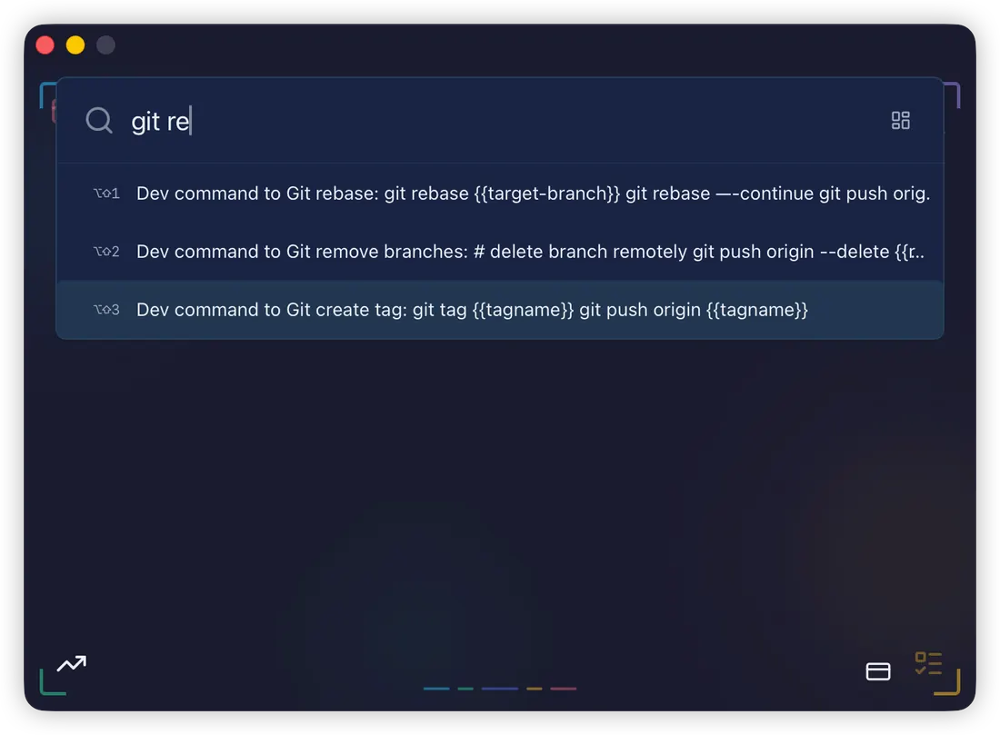
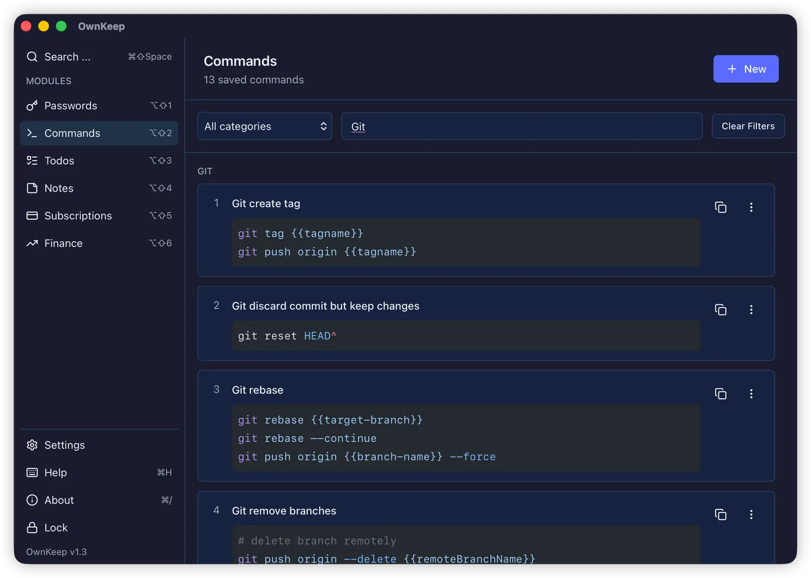
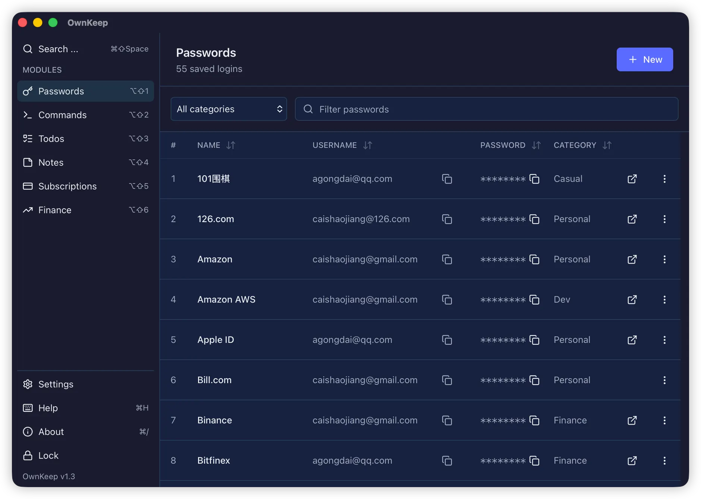
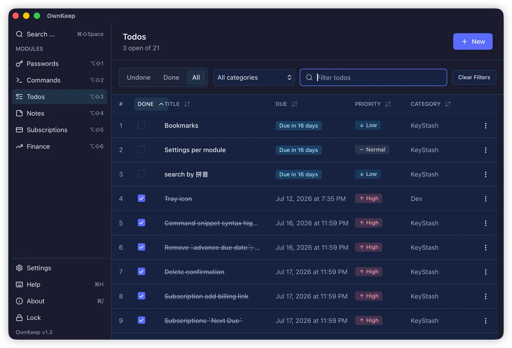
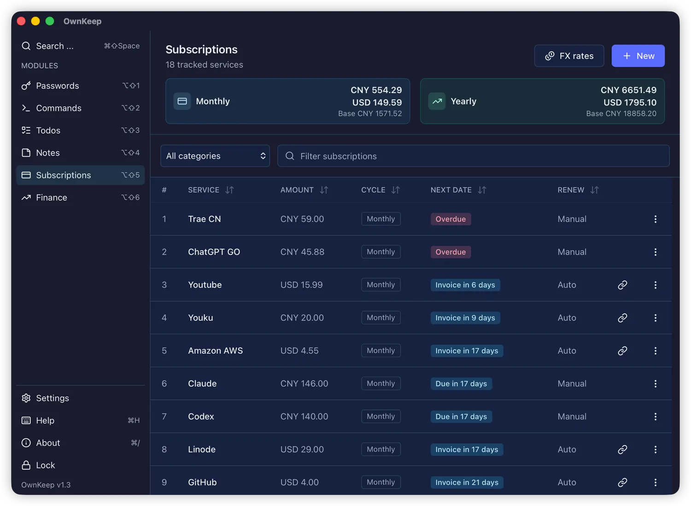
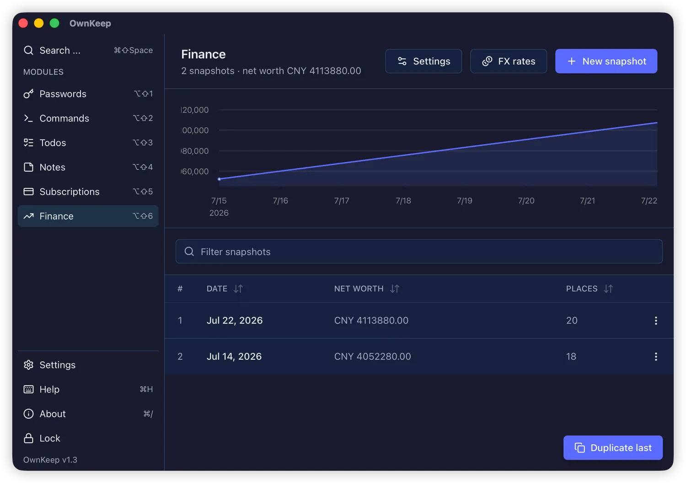
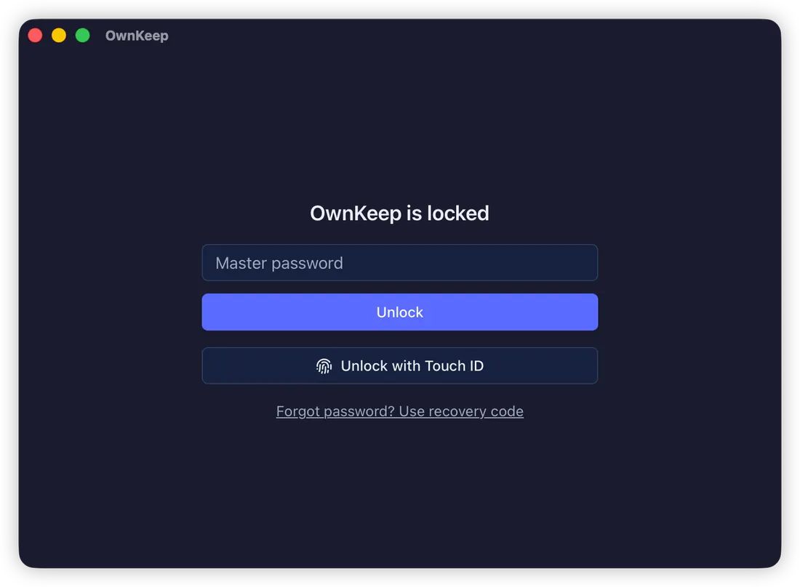
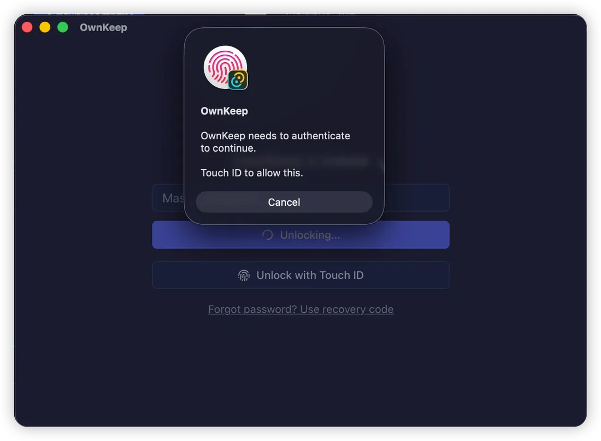
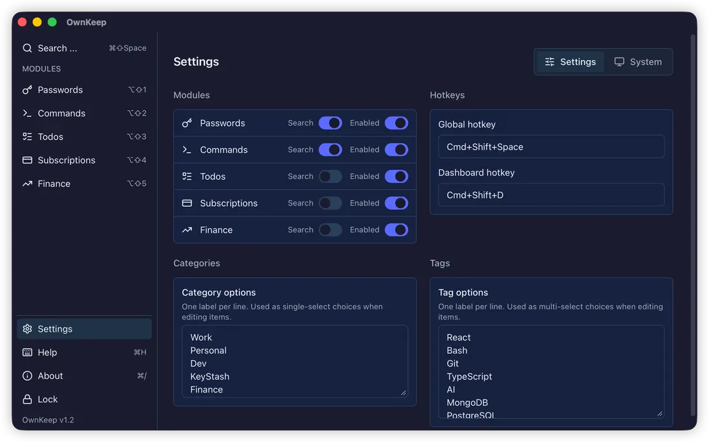
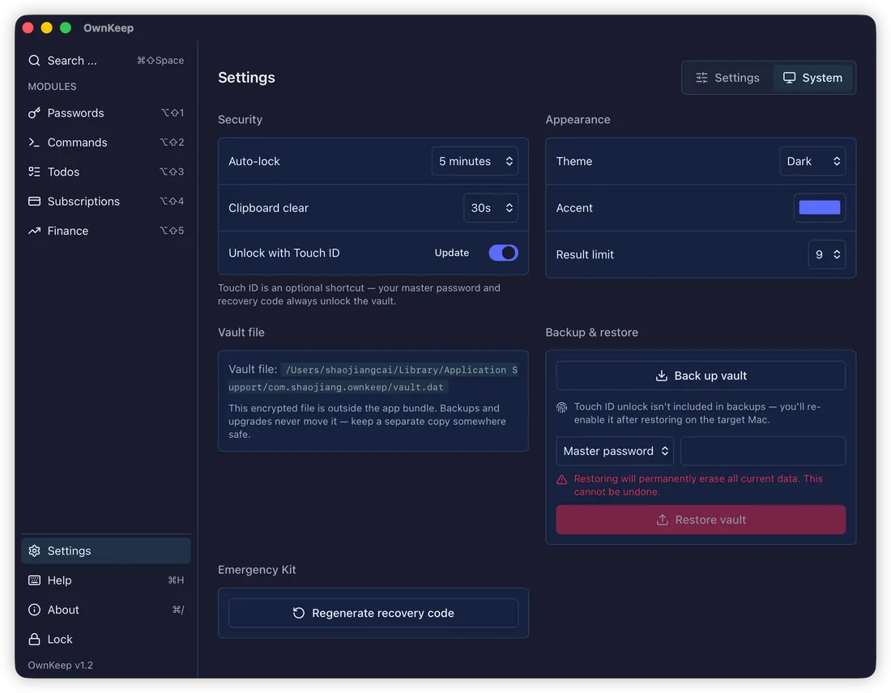

<div align="center">


# OwnKeep

### One hotkey for the things you shouldn't lose

Your shell incantations, your logins, your renewal dates — behind a single Spotlight-style bar,
in one encrypted file on your own Mac. No cloud, no account, no telemetry.

[](https://github.com/ownkeep-app/ownkeep/releases/latest)

[](LICENSE)
[](https://github.com/ownkeep-app/ownkeep/releases/latest)
[](https://github.com/ownkeep-app/ownkeep/releases/latest)
[](SECURITY.md)
[](#test--quality)
[](https://ownkeep.app)



<sub><code>⌘⇧Space</code> from anywhere · type a few letters · <code>⌥⇧1</code> to copy</sub>

</div>

---

## The problem

You already have somewhere to put passwords. You probably don't have anywhere good to put
`git rebase {{target-branch}}`, or the `docker run` invocation you rewrite from memory every few
weeks, or the date your domain renews.

So it ends up scattered: half in a notes app, half in shell history, half in a gist you can't find.
Meanwhile your password manager — the one tool you actually trained yourself to open — refuses to
hold anything that isn't a login.

**OwnKeep is that tool, widened.** One bar, one hotkey, one encrypted file, for everything you'd hate
to lose and can never quite remember.

## A command library that fills itself in

Save a snippet once with `{{placeholder}}` markers. When you pick it, OwnKeep prompts for the values
and copies the finished command — so a template with a placeholder in the middle works exactly as
well as one with a placeholder at the end.



Snippets are syntax-highlighted, grouped into categories you define, and searchable by full text —
not just by title. `⌥⌘1`–`⌥⌘9` copies the raw template instead if you'd rather fill it in yourself.

## One bar for everything

The bar is the home screen. Results rank by **fuzzy match × frecency**, so the things you actually
use surface first instead of whatever happens to match alphabetically. Scope prefixes narrow to one
module when you already know where you're going.

Nothing needs the mouse: `⌥⇧1`–`⌥⇧9` runs a result's primary action — copy the password, fill in the
command — and `Esc` makes the bar disappear. It hides on blur too, so it never becomes another window
to manage.

## Modules you can switch off

Passwords and commands are the core. Todos, subscriptions, and finance are modules — each toggles
from Settings with its data preserved, and each shows up in the same bar and the same Dashboard
sidebar.

| | |
|:--|:--|
| <br>**Passwords** — logins with categories, sortable columns, and one-click concealed copy for usernames and passwords. | <br>**Todos** — due dates, priorities, recurrence, and notifications that fire once per window. |
| <br>**Subscriptions** — what renews, when, and what it costs, with lead-time reminders before you're charged. | <br>**Finance** — periodic snapshots, per-category stats, a net-worth trend, and a manual FX table. |

Calendar, notes, and bookmarks are candidates for later — the module registry is what makes adding
one a self-contained job rather than surgery on the core.

## One door in

<table>
<tr>
<td width="50%"></td>
<td width="50%"></td>
</tr>
</table>

The whole vault is a single file encrypted with **XChaCha20-Poly1305** under a key derived by
**Argon2id**. Secret values live in the Rust core and never enter the WebView; copying a password
writes it to the pasteboard as *concealed*, so clipboard-history tools skip it, and it auto-clears.

Your **master password** is never stored and cannot be recovered. The **recovery code** from your
Emergency Kit is the only other way in, and both always work.

**Touch ID is a shortcut, never a replacement.** Enrolling requires an already-unlocked vault, the
key is device-local and excluded from every backup, and a fingerprint change invalidates it — so
losing Touch ID can't lock you out of your own vault.

## Yours to configure

| | |
|:--|:--|
|  |  |
| Toggle modules on and off, rebind the hotkeys, define your own categories and tags, and pick a theme and accent that apply live. | Manage security, see exactly where your vault file lives, take a backup, and regenerate the Emergency Kit. |

## Install

[**Download the latest `.dmg`**](https://github.com/ownkeep-app/ownkeep/releases/latest) — Universal
2, macOS 13+, about 12 MB.

Open the DMG, drag OwnKeep to Applications, launch it. macOS asks for **Accessibility** permission so
the global hotkey works system-wide; OwnKeep then lives in the menu bar with no Dock icon.

Releases are signed with a Developer ID certificate, built with hardened runtime, and notarized by
Apple — so Gatekeeper opens it without a warning. Confirm that yourself rather than taking my word
for it:

```bash
spctl -a -vvv -t open --context context:primary-signature OwnKeep_1.2.0_universal.dmg
# accepted
# source=Notarized Developer ID
```

Prefer to build it? See [Development](#development).

## What OwnKeep isn't

Stated plainly, because it should save some people a download:

- **Not a 1Password or KeePassXC replacement.** No sync, no browser autofill, no TOTP generation, no import from other managers. If those are what you need, use KeePassXC or Bitwarden — genuinely good tools that OwnKeep isn't competing with.
- **Not audited.** Standard primitives, conventional parameters, property-tested crypto core, >95% coverage on both surfaces — but no third-party review. [SECURITY.md](SECURITY.md) is blunt about this and about everything else OwnKeep doesn't do.
- **Not cross-platform.** macOS 13+ only. Touch ID, the concealed clipboard, and the menu-bar behavior are macOS-native.
- **Not a team tool.** One person, one Mac, one file.

## Security

The exact construction — Argon2id parameters, the three-way envelope wrap, the Touch ID key's
Keychain attributes — is documented in [**SECURITY.md**](SECURITY.md), along with the limitations and
five commands you can run to verify the claims yourself. Read it before you put anything important in
here.

Found a vulnerability? [Report it privately](https://github.com/ownkeep-app/ownkeep/security/advisories/new) — please don't open a public issue.

## Documentation

- **What & why:** [`spec.md`](spec.md) · **Build order & status:** [`plan.md`](plan.md)
- **Contributing:** [`CONTRIBUTING.md`](CONTRIBUTING.md) · **Releasing:** [`RELEASING.md`](RELEASING.md)
- **Signing & Touch ID on macOS:** [`code-signing.md`](code-signing.md)
- **Rules for humans & AI agents:** [`AGENTS.md`](AGENTS.md), [`.cursor/rules/`](.cursor/rules/)

> **Status:** v1.2 shipped — signed, notarized, Touch ID live. The encrypted vault core, every
> feature module, the command bar, Dashboard, backup/restore, scheduler, and migration framework are
> all in place (see [`plan.md`](plan.md)).

---

# Development

## Stack

Tauri 2 (Rust core) · React 18 + TypeScript (Vite) · Tailwind CSS + shadcn/ui + Lucide · Zustand ·
Vitest + React Testing Library (frontend) · `cargo test` (Rust). See `spec.md` §2.

## Prerequisites

- **macOS 13+** (Apple Silicon or Intel)
- **Node.js ≥ 20** and **pnpm 10** (`corepack enable` provides pnpm)
- **Rust** (stable) via [rustup](https://rustup.rs)
- **Rust coverage tool:** `cargo install cargo-llvm-cov` (needed for `pnpm coverage:rust`)
- **Xcode Command Line Tools**: `xcode-select --install`

## Setup

```bash
pnpm install
```

## Develop

```bash
pnpm dev          # Tauri dev: Rust core + Vite front-end with hot reload
pnpm dev:web      # front-end only (Vite at http://localhost:1420), no Rust shell
```

On first launch, macOS will ask you to grant **Accessibility** permission so the global hotkey
(`Cmd+Shift+Space`) works system-wide. The app runs in the **menu bar** (no Dock icon); use the tray
icon's **Search ... / Dashboard / Exit** menu, or the hotkey to toggle the window. It hides on **Esc** or when it loses
focus.

Development builds use a separate vault (`vault-dev.dat`) and a separate Keychain service, so you
cannot damage a real vault while working on OwnKeep.

## Using OwnKeep

### First run & the Emergency Kit

On first run you set a **master password**. It encrypts the whole vault and is **never stored** — so
if you forget it, the only other way in is the **recovery code** shown once during onboarding as your
**Emergency Kit**.

- The recovery code is a random 12-word phrase that unlocks the entire vault, so store it **offline**
  (printed, or in a separate password manager) and **never beside the vault file**.
- Unlocking with the recovery code forces you to set a **new master password** on the spot.
- You can regenerate the Emergency Kit anytime from **Settings** (this re-wraps the recovery key; the
  old code stops working).

The vault lives at `~/Library/Application Support/com.shaojiang.ownkeep/vault.dat`
(`vault-dev.dat` in dev builds), outside the app bundle — see `spec.md` §3.2 and §4.

### Keyboard shortcuts

OwnKeep is keyboard-first. Press **`⌘H`** on either surface to open the in-app shortcut cheat
sheet (also reachable from the Help row in the Dashboard sidebar). The essentials:

| Where | Keys | Action |
|---|---|---|
| Anywhere | `⌘⇧Space` | Summon the command bar |
| Anywhere | `⌘⇧D` | Toggle the Dashboard window |
| Anywhere | `⌘H` | Show keyboard shortcuts |
| Anywhere | `⌘/` | About OwnKeep |
| Command bar | `⌥⇧1`–`⌥⇧9` | Run a result's primary action (e.g. copy password) |
| Command bar | `⌥⌘1`–`⌥⌘9` | Copy a command's raw template |
| Command bar | `Esc` | Hide the launcher |
| Dashboard | `⌥⇧1`–`⌥⇧9` / `↑ ↓` | Switch modules in the sidebar |

Copy and clipboard actions confirm with a toast; secret copies note when the clipboard auto-clears.

### Theme

Light / dark / system and the accent color are set in **Settings → Appearance** and apply live.

### Upgrading & the migration guide

OwnKeep upgrades by **manual replacement** — download a new `.dmg` and drag the new app over the old
OwnKeep app. Your data is untouched because the vault lives outside the app bundle.

Existing `.dat` backups remain restorable regardless of their filename prefix. After upgrading to
v1.2, regenerate the Emergency Kit once from Settings to move its recovery wrap to the current
OwnKeep derivation context; the v1.2 reader still accepts the existing code until you do.

When a new build introduces a data-shape change, opening your existing vault shows a **migration
guide** before anything is written: it summarizes added fields, shows renamed paths (`old → new`), and
lists removals **in red as data loss**. You then choose to:

- **Accept & upgrade** — writes an automatic pre-migration backup, applies the migration, and
  continues; or
- **Reject** — **Back up & quit**, **Erase & start fresh** (danger, irreversible), or **Quit**
  untouched.

Migrations are forward-only, so an older app refuses a migrated vault — to roll back, restore the
pre-migration backup with the older build. Full rules: `spec.md` §11.

## Test & quality

```bash
pnpm test                     # Vitest (front-end unit tests)
pnpm coverage                 # Vitest with V8 coverage; fails below 95%
pnpm coverage:rust            # cargo llvm-cov; fails below 95% Rust-core line coverage
pnpm coverage:all             # front-end + Rust coverage gates
pnpm typecheck                # tsc --noEmit
pnpm lint                     # ESLint
pnpm format                   # Prettier (write)   ·   pnpm format:check to verify
pnpm check                    # typecheck + lint + format:check + test

cd src-tauri && cargo test    # Rust core tests
```

Frontend coverage measures first-party application code (`src/**/*.{ts,tsx}`) and intentionally
excludes bootstrap glue, type-only files, test setup, and copied shadcn/ui primitives. The Rust
coverage gate measures the testable core modules with `cargo llvm-cov --fail-under-lines 95` and
excludes Tauri IPC/bootstrap glue (`commands.rs`, `lib.rs`, `main.rs`), which need later integration
coverage rather than unit coverage.

## Production build

```bash
pnpm build        # builds the front-end and bundles the macOS app
```

Output lands in `src-tauri/target/release/bundle/` (`.app` and `.dmg`).

Release builds are signed with a Developer ID certificate, built with hardened runtime, and notarized
and stapled by Apple — which is also what makes Touch ID work, since the biometric Keychain item
needs the app's private application-identifier entitlement and a matching embedded provisioning
profile. A local `pnpm build` without the signing assets produces an **ad-hoc signed** bundle:
fine for development, but Gatekeeper will reject it and Touch ID enrollment will fail with
`errSecMissingEntitlement`.

The full procedure is in [`code-signing.md`](code-signing.md); the release checklist — including the
verification commands to run **before** uploading an artifact — is in [`RELEASING.md`](RELEASING.md).

## Troubleshooting

- **Global hotkey does nothing** — grant Accessibility: System Settings → Privacy & Security →
  Accessibility → enable OwnKeep (or your terminal, in dev). The app is designed to also work from
  the tray if the permission is denied.
- **Window vanished** — that's the launcher behavior (hide on blur/Esc). Press `Cmd+Shift+Space` or
  use the tray's **Search ...**.
- **Touch ID button doesn't appear** — it needs a signed build and an already-unlocked vault to
  enroll from Settings → System → Security. See [`code-signing.md`](code-signing.md).
- **`Port 1420 is already in use`** — another Vite/OwnKeep dev server is running; stop it or free the
  port (the dev server uses a fixed port on purpose).
- **First `cargo`/Tauri build is slow** — the Rust core and Tauri dependencies compile from source
  the first time; subsequent builds are incremental.

## Layout

```
ownkeep/
├── src/            # React + TypeScript front-end (UI only; no secrets)
├── src-tauri/      # Rust core (crypto, storage, concealed clipboard, scheduler)
├── docs/media/     # README screenshots
├── spec.md         # product & technical spec
├── plan.md         # phased development plan
└── AGENTS.md       # AI-agent rules (also read by Codex, Claude, Cursor)
```

## Contributing

Issues and PRs are welcome — please read [`CONTRIBUTING.md`](CONTRIBUTING.md) first. OwnKeep is
spec-driven with a hard >95% coverage gate on both surfaces, and it has deliberate non-goals, so a
quick issue before you write code saves everyone an evening.

## License

[GPL-3.0-or-later](LICENSE). You can read it, build it, fork it, and run it however you like; if you
distribute a modified version, it stays open under the same terms.
